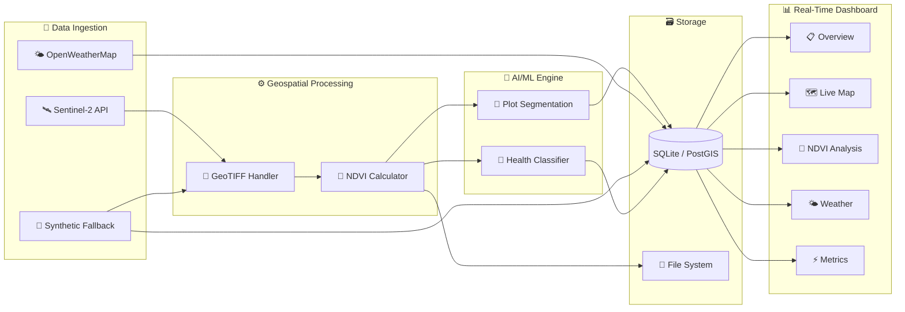

<p align="center">
  <h1 align="center">🌾 AI-Enhanced Drone Imagery Pipeline for Crop Protection</h1>
  <p align="center">
    <strong>Real-Time AI-Driven Geospatial Pipeline for Crop Health Monitoring</strong>
  </p>
  <p align="center">
    <a href="#features">Features</a> •
    <a href="#architecture">Architecture</a> •
    <a href="#getting-started">Getting Started</a> •
    <a href="#execution-guide">Execution Guide</a> •
    <a href="#dashboard">Dashboard</a> •
    <a href="#tech-stack">Tech Stack</a>
  </p>
</p>

---

## 📋 Project Overview

This project implements an **end-to-end AI-driven geospatial pipeline** that automates crop health monitoring using **Sentinel-2 satellite imagery**, **NDVI (Normalized Difference Vegetation Index)** analysis, and **multi-region weather intelligence**. The system ingests multi-spectral satellite data, performs vegetation health computation, classifies field conditions using a 4-tier health system, and delivers real-time insights through an interactive Streamlit dashboard.

### 🎯 Objective

To build a production-grade, automated crop protection system that:
- **Ingests** satellite imagery and weather data from multiple APIs
- **Processes** multi-band GeoTIFF imagery into actionable vegetation indices
- **Classifies** crop health using AI/ML segmentation and NDVI-threshold analysis
- **Monitors** weather and soil conditions across 18 global agricultural regions
- **Visualizes** everything in a real-time, interactive dashboard with multi-scale mapping

### 🧩 Problem Statement

Traditional crop monitoring depends on manual field surveys, which are:
- **Time-consuming** — inspecting large fields takes hours/days
- **Subjective** — human visual assessment lacks consistency
- **Reactive** — issues are identified only after visible damage

This pipeline solves these problems by providing **automated, continuous, data-driven monitoring** with sub-30-second processing latency.

---

## ✨ Features

| Feature | Description |
|---------|-------------|
| **🛰️ Satellite Data Ingestion** | Automated Sentinel-2 L2A multi-spectral data fetch (4 bands: Blue, Green, Red, NIR) with synthetic fallback |
| **🌿 NDVI Computation** | Real-time vegetation index calculation with color-mapped heatmaps and statistical analysis |
| **🔬 AI Crop Segmentation** | Morphological crop plot boundary delineation using connected-component analysis |
| **🏥 Health Classification** | 4-tier system: Healthy (>0.6) → Moderate (0.3–0.6) → Severe (0.1–0.3) → Critical (<0.1) |
| **🌤️ Multi-Region Weather** | Weather data for 18 global locations (13 US states + 5 international agro regions) |
| **🗺️ Interactive World Map** | Leaflet.js map with 4 zoom scales (World → Country → State → Field), NDVI overlay, weather markers |
| **📐 Boundary Layers** | Country/state boundaries, labels, and boundary toggles via Stamen Toner overlays |
| **🌱 Soil Monitoring** | Soil moisture and temperature tracking with drought/waterlogged thresholds |
| **🚜 Agricultural Alerts** | Automated frost, irrigation, disease, and spray advisories per location |
| **📊 Pipeline Metrics** | Processing latency tracking, success rates, and per-step breakdowns |
| **🔄 Synthetic Fallback** | Full demo mode — works completely offline without any API keys |

---

## 🏗️ Architecture



### Pipeline Flow

```
Sentinel-2 / Synthetic Data
        │
        ▼
   GeoTIFF Reader ──────► CRS Transform & Band Extraction
        │                        │
        ▼                        ▼
   NDVI Calculator         RGB Composite Generator
        │                        │
        ▼                        ▼
   Plot Segmentation       Color-mapped Heatmap (.png)
        │
        ▼
   Health Classifier
        │
        ▼
   ┌────────────────────────────────────┐
   │           SQLite Database          │
   │  • imagery_metadata               │
   │  • ndvi_results                   │
   │  • health_assessments             │
   │  • weather_data                   │
   │  • pipeline_runs                  │
   └────────────────────────────────────┘
        │
        ▼
   Streamlit Dashboard (5 interactive pages)
```

---

## 🚀 Getting Started

### Prerequisites

| Requirement | Version |
|------------|---------|
| **Python** | 3.9+ |
| **pip** | Latest |
| **OS** | macOS, Linux, or Windows |
| **Conda** (optional) | For isolated environments |

### Installation

#### Option 1: Using pip (Standard)

```bash
# Clone the repository
git clone https://github.com/your-username/ai-crop-health-pipeline.git
cd ai-crop-health-pipeline

# Create a virtual environment
python -m venv .venv
source .venv/bin/activate  # On Windows: .venv\Scripts\activate

# Install dependencies
pip install -r requirements.txt
```

#### Option 2: Using Conda

```bash
# Clone the repository
git clone https://github.com/your-username/ai-crop-health-pipeline.git
cd ai-crop-health-pipeline

# Create conda environment
conda create -n crop-health python=3.11 -y
conda activate crop-health

# Install dependencies
pip install -r requirements.txt
```

### API Configuration (Optional)

The pipeline runs **fully offline** with synthetic data. For live data, configure API keys:

```bash
# Copy the example env file
cp .env.example .env
```

Edit `.env` with your keys:

```env
# OpenWeatherMap (https://openweathermap.org/api)
OPENWEATHERMAP_API_KEY=your_api_key_here

# Sentinel Hub (https://www.sentinel-hub.com/)
SENTINEL_HUB_CLIENT_ID=your_client_id_here
SENTINEL_HUB_CLIENT_SECRET=your_client_secret_here

# Field Coordinates (default: Iowa Corn Belt)
FIELD_LAT=41.878
FIELD_LON=-93.098
FIELD_BBOX_SIZE_KM=2.0
```

| API | Purpose | Free Tier |
|-----|---------|-----------|
| [OpenWeatherMap](https://openweathermap.org/api) | Real-time weather & soil data | ✅ 1,000 calls/day |
| [Sentinel Hub](https://www.sentinel-hub.com/) | Multi-spectral satellite imagery | ✅ 30-day free trial |

> **Note:** If no API keys are provided, the system automatically generates realistic synthetic data for all modules.

---

## 📖 Execution Guide

### Step 1: Generate Sample Data

This creates synthetic satellite imagery, NDVI maps, weather data, and populates the SQLite database — **no API keys required**.

```bash
python scripts/generate_sample_data.py
```

**What it generates:**
- `data/raw/` — 5 synthetic multi-band GeoTIFF files (4 bands: Blue, Green, Red, NIR)
- `data/processed/` — 5 NDVI heatmap PNGs + GeoJSON plot boundaries
- `data/weather/` — Multi-region weather JSON files
- `data/crop_health.db` — SQLite database with all pipeline records

**Expected output:**
```
✅ Created 5 synthetic GeoTIFF files
✅ Computed NDVI for 5 images
✅ Generated segmentation polygons
✅ Classified health for all plots
✅ Inserted 24 weather records
✅ Pipeline run logged to database
```

### Step 2: Launch the Dashboard

```bash
streamlit run app.py
```

The dashboard opens at **http://localhost:8501** with 5 interactive pages.

### Step 3: Explore the Dashboard

| Page | What to Explore |
|------|----------------|
| **📋 Overview** | KPIs, health distribution pie chart, NDVI trend lines, active alerts |
| **🗺️ Live Map** | Switch zoom scales (World → Country → State → Field), click weather markers, toggle NDVI overlay |
| **🌿 NDVI Analysis** | NDVI distribution histogram, health class breakdown, time-series trends |
| **🌤️ Weather** | Multi-state temperature comparison, weather cards for 18 locations, soil moisture chart |
| **⚡ Pipeline Metrics** | Processing latency per step, pipeline run history, throughput metrics |

### Step 4: Run the Full Pipeline (Optional)

Click the **🔄 Run Pipeline** button in the dashboard sidebar to execute the full ingestion-to-visualization pipeline, or run it programmatically:

```bash
python -c "from data_ingestion.pipeline_scheduler import run_pipeline; run_pipeline()"
```

### Step 5: Refresh Multi-Region Weather

Navigate to the **🌤️ Weather** page and click **🔄 Refresh Weather** to generate fresh weather data for all 18 global locations.

---

## 📊 Dashboard

### 🗺️ Live Field Map

The interactive map supports **4 zoom scales** with full weather integration:

| Scale | Zoom | What You See |
|-------|------|-------------|
| **🌍 World** | 2 | Global agricultural markers (US + India, Brazil, France, China, Australia) |
| **🇺🇸 Country** | 4 | All 13 US agricultural states with weather popups |
| **🏛️ State** | 7 | Iowa region with field boundary visible |
| **🌾 Field** | 14 | Detailed NDVI overlay, plot boundaries, weather station |

**Map Features:**
- 5 base tile layers (Standard, Dark Mode, Satellite, Terrain, Street Map)
- Toggleable boundary and label overlays
- NDVI colorbar legend
- MiniMap navigation widget
- Layer control with US Weather / Global Weather groups

### 🌤️ Weather & Soil Conditions

18 monitored agricultural locations:

| Region | Locations |
|--------|-----------|
| **US Corn Belt** | Iowa, Illinois, Indiana, Nebraska, Minnesota, Ohio, Wisconsin, Missouri |
| **US Great Plains** | Kansas, North Dakota, South Dakota |
| **US West/South** | California, Texas |
| **International** | Punjab (India), São Paulo (Brazil), Île-de-France (France), Heilongjiang (China), New South Wales (Australia) |

Each location provides: temperature, humidity, wind speed, soil moisture, soil temperature, rainfall, cloud cover, and agricultural alerts.

---

## 🛠️ Tech Stack

### Core Technologies

| Category | Technologies |
|----------|-------------|
| **Language** | Python 3.9+ |
| **Dashboard** | Streamlit 1.41, Plotly 5.24, Folium 0.18 |
| **Geospatial** | Rasterio 1.4, GeoPandas 1.0, Shapely 2.0, PyProj 3.7 |
| **Image Processing** | scikit-image 0.24, SciPy 1.14, Pillow 11.1, Matplotlib 3.9 |
| **Data** | NumPy 1.26, Pandas 2.2 |
| **Database** | SQLite3 (PostGIS-compatible schema) |
| **APIs** | Sentinel Hub Process API, OpenWeatherMap Current Weather API |
| **Utilities** | python-dotenv, schedule, watchdog, requests |

### AI/ML Approach

| Technique | Application |
|-----------|-------------|
| **NDVI Threshold Classification** | 4-tier health assessment (Healthy/Moderate/Severe/Critical) |
| **Morphological Operations** | Erosion + dilation for noise removal in segmentation |
| **Connected Component Analysis** | Automatic crop plot boundary delineation |
| **Statistical Analysis** | Mean, std, percentile-based field health scoring |

---

## 📁 Project Structure

```
ai-crop-health-pipeline/
│
├── app.py                              # 🚀 Streamlit entry point & theme configuration
├── config.py                           # ⚙️ Central config: paths, coordinates, thresholds
├── requirements.txt                    # 📦 Python dependencies
├── .env.example                        # 🔑 API key template
│
├── data_ingestion/                     # 📡 Data Collection Layer
│   ├── __init__.py
│   ├── sentinel_fetcher.py             # Sentinel-2 L2A data fetcher (+ synthetic fallback)
│   ├── weather_fetcher.py              # OpenWeatherMap + multi-region weather (18 locations)
│   └── pipeline_scheduler.py           # End-to-end pipeline orchestration engine
│
├── processing/                         # ⚙️ Geospatial Processing Engine
│   ├── __init__.py
│   ├── ndvi_calculator.py              # NDVI computation, color mapping, statistics
│   └── geo_processor.py               # CRS transforms, composites, metadata extraction
│
├── ai_models/                          # 🤖 AI/ML Analysis
│   ├── __init__.py
│   ├── segmentation.py                 # Morphological plot segmentation → GeoJSON
│   └── health_classifier.py            # NDVI + weather → health classification & alerts
│
├── database/                           # 🗃️ Storage Layer
│   ├── __init__.py
│   └── db_manager.py                   # SQLite manager (5 tables, PostGIS-ready schema)
│
├── dashboard/                          # 📊 Real-Time Dashboard
│   ├── __init__.py
│   ├── overview_page.py                # KPIs, health distribution, alerts, recommendations
│   ├── map_page.py                     # Interactive Folium/Leaflet map (4 zoom scales)
│   ├── ndvi_page.py                    # NDVI histograms, time-series, image comparison
│   ├── weather_page.py                 # Multi-state weather comparison, soil moisture charts
│   └── metrics_page.py                 # Pipeline latency, success rates, step breakdowns
│
├── scripts/                            # 🔧 Utility Scripts
│   ├── __init__.py
│   └── generate_sample_data.py         # Complete demo dataset generator
│
├── data/                               # 📂 Data Directory (auto-generated)
│   ├── raw/                            # Raw GeoTIFF satellite imagery
│   ├── processed/                      # NDVI heatmaps, GeoJSON boundaries
│   ├── weather/                        # Weather JSON files
│   └── crop_health.db                  # SQLite database
│
└── models/                             # 🧠 Model Artifacts (future: SAM, YOLO)
```

---

## 📐 Database Schema

The SQLite database uses a PostGIS-compatible schema with 5 tables:

| Table | Records | Purpose |
|-------|---------|---------|
| `imagery_metadata` | Per-image | Band info, resolution, source, timestamps |
| `ndvi_results` | Per-analysis | Min/max/mean NDVI, area by health class |
| `health_assessments` | Per-analysis | Overall health score, recommendations, alerts |
| `weather_data` | Per-fetch | Temperature, humidity, soil, precipitation |
| `pipeline_runs` | Per-run | Latency, step timings, success/failure status |

---

## 📈 Key Metrics & Results

| Metric | Value |
|--------|-------|
| **Processing Latency** | < 30 seconds (upload → dashboard) |
| **Weather Coverage** | 18 global agricultural locations |
| **Map Zoom Levels** | 4 scales (World / Country / State / Field) |
| **Tile Layers** | 5 base maps + 2 overlay layers |
| **Health Classes** | 4-tier NDVI-based classification |
| **Database Tables** | 5 (PostGIS-compatible schema) |
| **Satellite Bands** | 4 (Blue, Green, Red, NIR at 10m resolution) |
| **Alert Categories** | 4 (Frost, Irrigation, Disease, Spray) |

---

## 🔧 Configuration Reference

### Environment Variables

| Variable | Default | Description |
|----------|---------|-------------|
| `OPENWEATHERMAP_API_KEY` | — | OpenWeatherMap API key |
| `SENTINEL_HUB_CLIENT_ID` | — | Sentinel Hub OAuth client ID |
| `SENTINEL_HUB_CLIENT_SECRET` | — | Sentinel Hub OAuth client secret |
| `FIELD_LAT` | `41.878` | Field center latitude |
| `FIELD_LON` | `-93.098` | Field center longitude |
| `FIELD_BBOX_SIZE_KM` | `2.0` | Bounding box size in km |
| `AUTO_REFRESH_SECONDS` | `300` | Auto-refresh interval |
| `NDVI_HEALTHY_THRESHOLD` | `0.6` | NDVI threshold for "Healthy" |
| `NDVI_MODERATE_THRESHOLD` | `0.3` | NDVI threshold for "Moderate" |
| `NDVI_SEVERE_THRESHOLD` | `0.1` | NDVI threshold for "Severe" |

### NDVI Health Classification

| Class | NDVI Range | Color | Interpretation |
|-------|-----------|-------|----------------|
| 🟢 **Healthy** | > 0.6 | Green | Dense, active vegetation |
| 🟡 **Moderate** | 0.3 – 0.6 | Yellow | Moderate vegetation / early stress |
| 🔴 **Severe** | 0.1 – 0.3 | Red | Sparse vegetation / significant stress |
| 🟣 **Critical** | < 0.1 | Purple | Bare soil / dead vegetation |

---

## 🔮 Future Roadmap

- [ ] **SAM Integration** — Meta's Segment Anything Model for pixel-level crop segmentation
- [ ] **YOLOv8 Detection** — Real-time pest and disease detection from drone imagery
- [ ] **PostGIS Migration** — PostgreSQL + PostGIS for large-scale spatial queries
- [ ] **Drone Integration** — Direct DJI/Parrot drone feed ingestion
- [ ] **Alert Notifications** — SMS/email alerts via Twilio/SendGrid
- [ ] **Multi-Field Support** — Monitor multiple fields simultaneously
- [ ] **Time-Series Forecasting** — LSTM/Prophet models for NDVI prediction
- [ ] **Mobile App** — React Native companion app for field scouts

---

## 🤝 Contributing

1. Fork the repository
2. Create your feature branch (`git checkout -b feature/amazing-feature`)
3. Commit your changes (`git commit -m 'Add amazing feature'`)
4. Push to the branch (`git push origin feature/amazing-feature`)
5. Open a Pull Request

---

## 📄 License

This project is licensed under the MIT License — see the [LICENSE](LICENSE) file for details.

---

<p align="center">
  <strong>Built with ❤️ for Precision Agriculture</strong><br>
  <em>Powered by Sentinel-2 🛰️ • Streamlit 📊 • Folium 🗺️</em>
</p>
